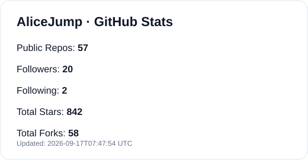
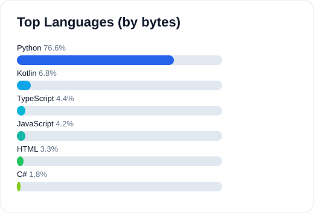

# AliceJump · Developer Profile

Clean, static-first GitHub profile powered by GitHub Actions (no `github-readme-stats.vercel.app`).

## About
- Backend / Data / Automation focused engineer
- Building stable developer tools and practical workflows
- Prefer reliability, observability, and maintainable architecture

## Stats (Static Assets, Action Generated)

  

  

> Data source: GitHub API → generated as static SVG/JSON by `.github/workflows/stats.yml`.

## Featured Projects
### Insights
轻量级统计与分析实践仓库。
`Python` `Data` `Automation` `GitHub Actions`

### DevOps Snippets
常用 CI/CD 与自动化脚本整理。
`Shell` `CI/CD` `Tooling`

### Portfolio Utilities
个人开发效率工具集合。
`CLI` `Productivity` `Open Source`

## Notes on Stability
- ✅ Keep: local static `overview.svg` + `top-languages.svg`
- ❌ Remove: trophy cards by default (historically depends on unstable third-party endpoints)
- 🔄 Optional fallback mirrors (only when needed):
  - `https://github-readme-stats-one-bice.vercel.app`
  - `https://github-readme-stats-git-masterrstaa-rickstaa.vercel.app`

## Manual Refresh
1. Open **Actions** → **Update Profile Stats**
2. Click **Run workflow**
3. README cards update from committed static files
